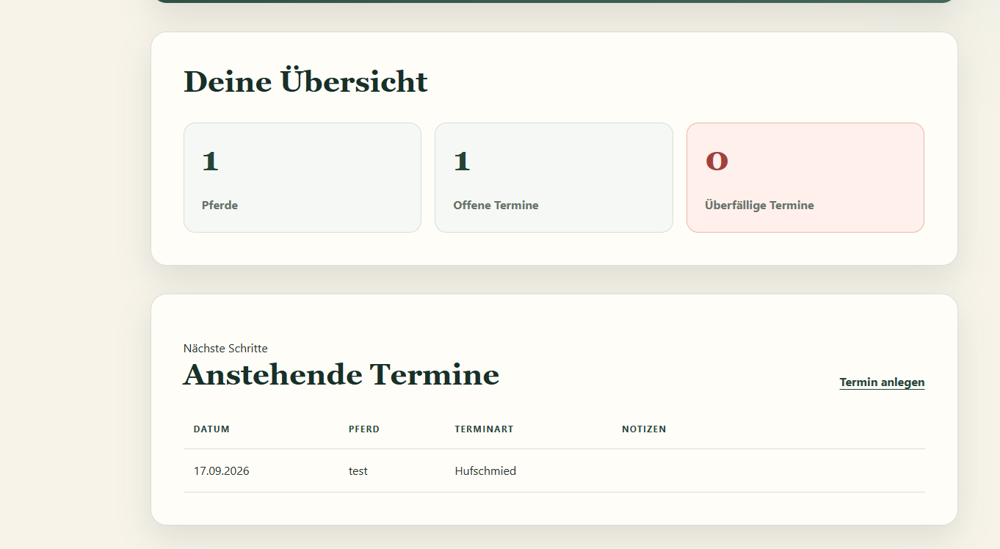

# EquiTrack

Eine Java-Webanwendung zur Verwaltung von Pferdeprofilen und wichtigen
Terminen.



## Motivation

EquiTrack bündelt wichtige Informationen zu Pferden an einem Ort.
Pferdeprofile sowie Tierarzt-, Hufschmied- und Impftermine können
übersichtlich verwaltet werden.

Das Projekt entstand als Portfolio-Projekt im Rahmen meiner Umschulung
zur Fachinformatikerin für Anwendungsentwicklung.

## Funktionen

### Pferdeprofile

- Pferde anlegen, anzeigen, bearbeiten und löschen
- Name, Geburtsdatum, Rasse und Geschlecht erfassen
- Farbe, Stockmaß und Notizen dokumentieren
- Formulareingaben validieren
- Daten dauerhaft lokal speichern

### Termine

- Termine einem Pferd zuordnen
- Tierarzt-, Hufschmied-, Impf- und Zahnarzttermine verwalten
- Termine bearbeiten und löschen
- Termine als erledigt oder offen markieren
- überfällige Termine automatisch erkennen und hervorheben
- Termine chronologisch sortieren

### Dashboard

- Anzahl der gespeicherten Pferde
- Anzahl offener Termine
- Anzahl überfälliger Termine
- nächste fünf anstehende Termine

## Technologien

- Java 21
- Spring Boot
- Spring MVC
- Thymeleaf
- Spring Data JPA
- Hibernate
- H2-Datenbank
- Bean Validation
- JUnit 5
- HTML und CSS
- Maven
- Git und GitHub

## Projekt lokal starten

Voraussetzung ist ein installiertes Java 21 JDK.

```powershell
git clone https://github.com/JuliaMiele/EquiTrack.git
cd EquiTrack
.\mvnw.cmd spring-boot:run
```

Die Anwendung ist anschließend erreichbar unter:

```text
http://localhost:8081
```

## Tests ausführen

```powershell
.\mvnw.cmd test
```

Die automatisierten Tests prüfen unter anderem:

- offene vergangene Termine werden als überfällig erkannt
- zukünftige Termine sind nicht überfällig
- erledigte vergangene Termine sind nicht mehr überfällig

## Datenschutz

Die Anwendung ist aktuell für die lokale Nutzung vorgesehen.
Pferdeprofile und Termine werden ausschließlich in einer lokalen
H2-Datenbank gespeichert und nicht an externe Dienste übertragen.

Der Datenbankordner `data/` ist über `.gitignore` von der
Veröffentlichung ausgeschlossen. Der Screenshot in dieser README
enthält ausschließlich fiktive Testdaten.

Vor einem öffentlichen oder produktiven Einsatz wären insbesondere
Authentifizierung, Berechtigungen, Datensicherung und ein erweitertes
Datenschutzkonzept erforderlich.

## Status

Die erste funktionsfähige Version ist fertig. Denkbare Erweiterungen
sind Pferdefotos, Erinnerungen, Trainingsdokumentation und
Fütterungspläne.